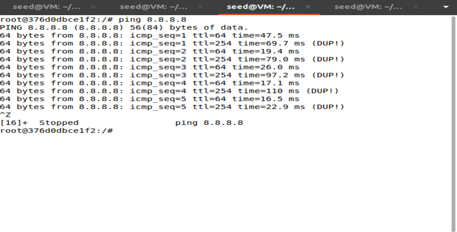
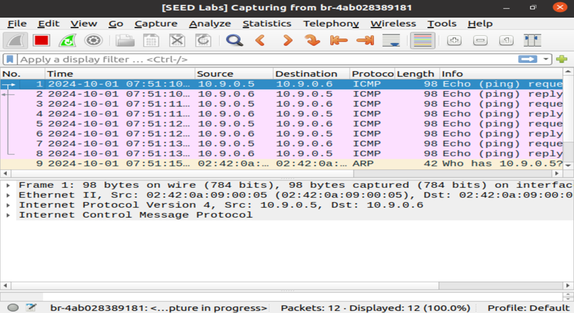

# Packet Sniffing and Spoofing Lab Task 1

Lab Handout: https://seedsecuritylabs.org/Labs_20.04/Networking/Sniffing_Spoofing/

This task involves using Scapy to capture and analyze network packets based on specific filters, including ICMP, TCP, and subnet traffic. The goal is to understand how packet sniffing works and how to filter network traffic effectively.

## Task 1.1A:
To observe the difference in packet capturing capabilities when running the sniffer with and without root privileges, I first generated network traffic by pinging another host (Host B). This generates ICMP packets that could be captured by the attacker.


#### With Root Privilege

When running the sniffer with root privileges, the script successfully captured and displayed the details of Ethernet, IP, and ICMP packets. This indicates that the sniffer has the necessary permissions to access raw socket interfaces, allowing it to capture packets from the network interface specified (in this case, `br-4ab028389181`).

#### Without Root Privilege

When running the sniffer without root privileges, a `PermissionError` occurred. This error indicates that the script was unable to access the raw socket needed to sniff packets. Non-root users typically do not have the permissions required to create raw sockets, which is necessary for capturing packets at the data link layer.

## Task 1.1B:
For this task, I referred to this [BPF cheat sheet](https://assets.ctfassets.net/yjhod2jd8xdy/2f981ngjYzSMcs7EaBOV9G/42750299e5ba03a42446a95d9399eab4/19-GIG-62-bpf-reference-guide-r3.2.pdf).

The interface for all the scripts was identified from the ID from `dockps`.

In this task, the `sniffer.py` script is modified to capture different types of network packets, including ICMP, TCP, and subnet traffic. Below is the original script along with the modifications made for each type of packet.
```
#!/usr/bin/env python3
from scapy.all import *
	
def print_pkt(pkt):
    pkt.show()

# Initial filter for ICMP packets MODIFIED LATER!!
pkt = sniff(iface='br-4ab028389181', filter='icmp', prn=print_pkt) 
```
I specified the network interface as `iface='br-4ab028389181'`, which I identified from the output of the `ifconfig` command.


### Capture only the ICMP packet:
```
pkt = sniff(iface='br-4ab028389181', filter='icmp', prn=print_pkt)
```
From Host A, I pinged Host B.


You can see the protocol is ICMP, with the source as Host A’s IP (`10.9.0.5`) and the destination as Host B’s IP (`10.9.0.6`).


### Capture any TCP packet that comes from a particular IP and with a destination port number 23:
```
pkt = sniff(iface='br-4ab028389181', filter='tcp && src host 10.9.0.6 && dst port 23', prn=print_pkt)
```

From Host A, I used `telnet` to connect to `10.9.0.6`, as telnet uses port 23.


You can see the protocol is `TCP`, and the destination port is for `telnet` (port 23).


### Capture packets comes from or to go to a particular subnet. You can pick any subnet, such as 128.230.0.0/16; you should not pick the subnet that your VM is attached to
```
pkt = sniff(iface='br-4ab028389181', filter='net 128.230.0.0/16', prn=print_pkt)
```

I pinged `128.230.0.15`. The subnet `128.230.0.0/16` includes IP addresses ranging from `128.230.0.1` to `128.230.255.254`. Therefore, `128.230.0.15` falls within this range.


You can see the source coming from Host A and the destination being `128.230.0.15` (which is within `128.230.0.0/16`).


## Task 1.2:
To spoof ICMP echo request packet with an arbitrary source IP address, we can set the `src` field of the IP header.
```
#!/usr/bin/env python3
from scapy.all import *
a = IP()
a.src = '1.2.3.4 '  # Arbitrary spoofed source IP
a.dst = '10.9.0.5'  # Modify to Host A in network to observe in Wireshark
b = ICMP()
p = a / b
send(p)
ls(p)
```

After running the script, `ls(p)` displays the fields, including the spoofed source IP address, in the packet.


We can also observe the spoofed IP address from Wireshark. It captures show the outgoing ICMP packet with the spoofed source IP and the corresponding ICMP echo reply sent to the spoofed address, confirming the success of the spoofing.


## Task 1.3:
To find an estimate of number of hops between VM and selected destination, we can modify the code given in the lab handout and implement a custom traceroute tool: [traceroute.py](./Code/traceroute.py)

### Tracing 1.2.3.4:
After `TTL=4`, there was no response from the network. This suggests that the packet reached a point where further hops were unresponsive. This is likely because the host is unreachable.


### Tracing 8.8.8.8:
We successfully recorded responses from intermediate routers up to `TTL=11`, at which point the destination was reached. The IP addresses shown in the output when TTL was less than 11 correspond to the routers along the path that handle the packet.


## Task 1.4:
To implement this task, I created a Python script called [sniffspoof.py](./Code/sniffspoof.py) using Scapy. This script is designed to sniff ICMP echo requests on the network and immediately send spoofed ICMP echo replies. The script accepts a command-line argument for the host IP address to be spoofed.

I conducted the three ping tests from Host A (`10.9.0.5`).

### A non-existing host on the Internet (1.2.3.4):
When I pinged `1.2.3.4`, a non-existent host on the internet, the ping command still received an echo reply. Although `1.2.3.4` does not exist, the ICMP echo request was captured by `sniffspoof.py`. A spoofed ICMP echo reply with the source IP of `1.2.3.4` was generated and sent back. Therefore, the ping program thought it received a valid response, even though the reply was fake.

We can see the modified source IP of the spoofed reply coming from `1.2.3.4`.


### A non-existing host on the LAN (10.9.0.99):
When I pinged `10.9.0.99`, a non-existing host on the local network, the ping command failed with the message `Destination Host Unreachable`. This behaviour occurs because `10.9.0.99` does not exist on the LAN, and the router or the host responsible for responding to unreachable destinations sent an ICMP "Destination Unreachable" (type 3) message. Since `sniffspoof.py` only handles ICMP echo requests (type 8), it did not generate a spoofed response. 

No spoofed reply was generated because the request never reached it, and the error was triggered by the network instead.


### An existing host on the Internet (8.8.8.8):
When I pinged `8.8.8.8`, an existing host (Google's DNS server), the ping command received two replies for each ICMP echo request. The `DUP!` flag in the output indicates duplicate replies. One of the replies came from Google's DNS server, as expected, with a high TTL value of 254. The other reply was a spoofed packet from `sniffspoof.py` with a lower TTL value of 64. This is because the script saw the ICMP echo request and sent a fake reply as if it came from `8.8.8.8`.



## Research Questions:
1. Without using sniffing, open Wireshark in the seed VM and ping between user A and B in the docker. Can you able to see the traffic in the Wireshark. If yes, explain why in this case is possible?

Yes, you can see the traffic in Wireshark even without using sniffing directly in Docker. Wireshark listens to all network interfaces on the host machine, including traffic from Docker containers. Since Docker containers share the host’s network stack or a virtualized network interface, Wireshark can capture the packets exchanged between containers.



2.	Can you provide a mechanism/method(s) which uses sniffing on the network for legitimate purposes?

Network administrators can use sniffing tools to monitor traffic flows, diagnose performance issues, and identify network bottlenecks. By analysing the packets flowing through the network, administrators can identify abnormal traffic patterns, congestion, and delays in network transmission. For example, a company might use sniffing tools to detect packet loss, latency issues, or high round-trip times between their servers and client systems, allowing them to optimize the network for better performance.

3.	Name a tool which uses sniffing and spoofing for testing purposes or ethical purposes?

[BetterCAP](https://www.bettercap.org/). It is a tool used for network monitoring, penetration testing, and ethical hacking. It employs sniffing to capture network traffic and spoofing techniques like ARP and DNS spoofing to test network vulnerabilities and defences.
